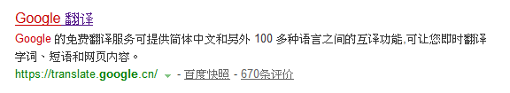

# 文档元数据(Document Metadata)

含有页面相关信息, 包括样式, 脚本及数据; 能帮助一些软件(搜索引擎, 浏览器等)更好地运用和渲染页面. 对于样式和脚本的元数据, 可以直接在网页里定义, 也可以链接到包含相关信息的外部文件中


```html
<head>
    <!-- ... -->
</head>
```

`<head>`元素包含文档的元数据(文档相关的配置信息), 元数据向浏览器提供了有关文档内容和标记的信息, 还包含脚本和对外部资源(样式表, 小图标等)的引用

### 元数据元素(头标签)

放置在`<head>`元素中, 提供关于`HTML`文档的信息

#### 设置文档标题

```html
<title>Document Title</title>
```

浏览器通常将元素内容显示在窗口或标签页的顶部, 整个文档只有一个

#### 设置相对URL的解析基准(默认地址)

```html
<base href="http://www.baidu.com/" target="_blank">
```

设置页面中绝对URL的调转基准(未设置则以当前HTML页面URL为准); 一份文档只能有一个

#### 元数据

```html
<meta charset="utf-8" />
<!-- 3秒后, 页面跳转到指定URL -->
<meta http-equiv="refresh" content="3;http://www.baidu.com">
```
空元素(void element)形式, 用于定义文档的各种元数据; 表示那些不能由其他`HTML`相关元素(`<base>` `<link>` `<script>` `<style>` `<title>`)表示的任何元数据

属性
* 模拟HTTP标头字段: `http-equiv` `content`
    ```html
    <!-- 定义文档内容类型, 编码 -->
    <meta http-equiv="Content-Type" content="text/html; charset=UTF-8" />
    ```
* 指定名值数据对: `name` `content`
    ```html
    <!-- 关键字内容 供搜索引擎使用, 提高搜索命中率 SEO -->
    <meta name="keywords" content="网易, 邮箱, 游戏">

    <!-- 页面描述, 显示在搜索结果中的内容 -->
    <meta content="Google 的免費翻譯服務，提供中文和另外上百種語言的互譯功能，讓你即時翻譯字句和網頁內容。" name="description">
    ```

    
    (不同语言会有不同版本(?))

### 定义CSS样式
`<style rel="stylesheet"></style>` 包含文档的样式信息或文档的部分内容; 默认情况下是CSS格式

### 指定外部资源

`<link>` 规定外部资源与当前文档的关系

* 外部样式表
    ```html
    <link href="" rel="stylesheet">
    ```
* 页面的网站标志(显示在窗口或标签页中)
    ```html
    <!-- 如果标志文件位于根目录, 浏览器会自动读取 -->
    <link rel="shortcut icon" href="favicon.ico" type="image/x-icon">


### 脚本

创建动态内容和Web应用程序, HTML支持使用的语言脚本, 最常用的就是 `JavaScript`

`<script>` 用于嵌入或引用可执行脚本

```html
<!-- 内嵌脚本 -->
<script>
//...
</script>

<!-- 外部脚本 -->
<script src="main.js"></script>
```

`<noscript></noscript>` 如果页面上的脚本类型不受支持或当前在浏览器中关闭了脚本, 则在`<nosciprt>`中定义脚本未被执行时的替代内容

<canvas> 可被用来通过脚本(通常是`JavaScript`)绘制图形. 通常用来绘制图片, 制作图片集合, 甚至用来实现动画效果.也可以在标签内写入可替代的代码内容, 会在不支持`<canvas>`元素或禁用`JavaScript`的浏览器内渲染并显示