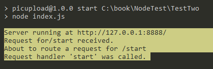
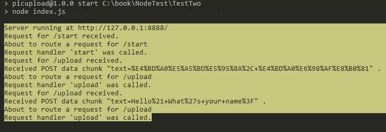
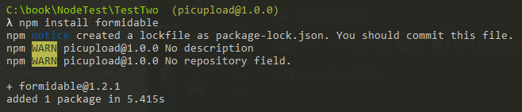

# Node入门

[NodeBeginer](https://www.nodebeginner.org/index-zh-cn.html)

## 服务端JavaScript

相对于浏览器环境, Node.js事实上就是另外一种上下文, 允许在后端(脱离浏览器环境)运行JavaScript代码

实现后台运行`JavaScript`代码, 代码需要先被解释然后正确的执行

`Node.js`的原理: 使用`Google`的`V8`虚拟机(Chrome浏览器使用的JavaScript执行环境), 来解释和执行`JavaScript`代码

## 一个完整的基于Node.js的Web应用

### 用例需求

* 用户可以通过浏览器使用应用
* 当用户请求`http://domain/start`时, 可以看到一个欢迎页面, 页面上有一个文件上传的表单
* 用户可以选择一个图片并提交表单, 随后文件将被上传到`http://domain/upload`, 该页面完成上传后会把图片显示在页面上

### 不同模块分析

* Web页面, 需要一个`HTTP`服务器
* 对于不同请求, 根据请求的URL, 我们的服务器需要给与不同的响应; 因此需要一个路由(?), 用于把请求对应到请求处理程序(request handler)
* 当请求被服务器接收并通过路由传递后, 需要对其进行处理; 因此需要最终的请求处理程序
* 路由还应该能处理`POST`数据, 并把数据封装成更友好的格式传递给请求处理程序, 因此需要请求数据处理功能
* 我们不仅仅要处理`URL`对应的请求, 还要把内容显示出来, 因此需要一些视图逻辑供请求处理程序使用, 以便将内容发送给用户的浏览器
* 最后, 用户需要上传图片, 所以需要上传处理功能来处理这方面

## 构建应用的模块

### 基础的HTTP服务器

```JS
    //简单的服务器

    //导入http模块
    var http = require("http");

    //调用createServer方法创建服务器
    http.createServer(function(request, response){
        //编写响应头部
        //状态码: 200
        //Content-Type: text/plain
        //发送响应" Hellow World"
        //响应结束
        response.writeHead(200, {"Content-Type": "text/plain"});
        response.write("Hello World");
        response.end();
    }).listen(8888); //调用listen方法监听 8888 端口

    //终端提示文本
    console.log("Server running at http://127.0.0.1:8888/");
```

### 分析HTTP服务器

1. 请求(require)`Node.js`中自带的`http`模块, 赋值给`http`变量
2. 调用`http`模块的`createServer`函数, 函数会返回一个对象, 有一个`listen`方法; `listen`有一个数值参数,指定该服务器监听的端口号
3. `createServer`函数存在一个参数, 是一个匿名函数

### 进行函数传递

JS中, 函数可以作为参数; 使用匿名函数作为参数

### 函数传递是如何让HTTP服务器工作的

### 基于事件驱动的回调(callback)

当我们使用`http.createServer`方法时, 我们不仅想要监听某一端口, 还想要在服务器收到`HTTP`请求时做些什么

问题是, 这是**异步**的: 请求任何时候都可能到达, 但服务器却跑在一个**单进程**中

原理: 

我们创建了服务器, 并且向创建它的方法传递了一个函数. 无论何时我们的服务器收到一个请求, 这个函数就会被调用

我们不知道事件什么时候会发生, 但现在我们有了一个处理请求的地方(传递的函数), 至于函数是预先定义的还是匿名, 就无关紧要了

这就是回调, 我们给某个方法传递了一个函数, 这个方法在有相应事件发生时就会调用这个函数进行回调(?)

### 服务器是如何处理请求的

请求发生时, 两个参数(request, response)会传入回调函数; 可以通过使用这两个参数的方法来处理`HTTP`请求的细节, 并且响应请求

收到请求后, 我们调用了`response`的`writeHead()`方法, 为响应添加了状态码`200`和头部`Cotent-Type: text/plain`, 表明响应完成, 并且响应主体类型是文本; 调用`write()`方法添加响应主体内容`Hello World`; 最后调用`end()`方法, 完成响应

### 服务端模块放在哪里

通常来说, 我们会使用`index.js`的文件去调用其他模块来引导和启动应用

如何将`server.js`变成一个真正的`Node.js`模块, 使它可以被我们的`index.js`主文件调用

把某段代码变成模块意味着我们需要把我们希望提供其功能的部分导出到请求这个模块的脚本中

首先, 修改server.js, 将创建服务器的脚本放入一个函数, 以便可以导出

```js
//将服务器脚本放入start函数中, 从而可以导出函数
function start() {
    //调用createServer方法创建服务器
    http.createServer(
        function (request, response) {
            console.log("Request received");
            //编写响应头部
            //状态码: 200
            //Content-Type: text/plain
            //发送响应" Hellow World"
            //响应结束
            response.writeHead(200, { "Content-Type": "text/plain" });
            response.write("Hello World");
            response.end();
        }).listen(8888); //调用listen方法监听 8888 端口
        //终端提示文本
        console.log("Server running at http://127.0.0.1:8888/");
}

//NOTE 导出这个函数
exports.start = start;
```
再创建 `index.js` 调用该模块, 并使用导出的方法创建服务器

```js
//导入自定义的server模块
var server = require("./server");

//使用模块的start()方法, 创建服务器
server.start();
```

现在做些改进: 对于不同的服务器请求, 服务器应该做出不同的反应; 这个部分(路由选择)我们分离出来, 创建一个新的**路由**(?)模块

### 如何来进行请求的"路由"

我们要为路由提供请求的`URL`和其他需要的`GET`及`POST`参数, 随后路由需要根据这些数据来执行相应代码

因此, 我们需要获取请求的`URL`, `GET`和`POST`参数, 我们暂且将其作为服务器的功能

`/start(url.parse(string).pathname)?foo=bar(querystring(string)["foo"](为"bar"))&hello=word(url.parse(string).query)`

我们需要的所有数据都包含在`request`对象中, 为了解析这个数据, 我们要导入 `url` 和 `querystring`(?) 模块

* 修改`server.js`

    通过导入`url`模块, 调用`url.parse(request.url).pathname`来获得`url`路径名

    ```js
    //导入 url 模块
    var url = require("url");
        
        //...
        //start函数中的修改
        var onRequest = function (request, response) {
            //调用url.parse() 转换请求的url
            //调用.pathname() 方法获得请求url的 pathname 值
            var pathname = url.parse(request.url).pathname;
            console.log("Request for" + pathname + "received.");
            //编写响应头部
            //状态码: 200
            //Content-Type: text/plain
            //发送响应" Hellow World"
            //响应结束
            response.writeHead(200, { "Content-Type": "text/plain" });
            response.write("Hello World");
            response.end();
        }
        //...
    ```
    我们得到路径名后, 就可以根据请求的`URL`路径不同来处理不同的请求

* 编写路由, 建立router.js文件
    ```js
    function route(pathname) {
        console.log("About to route a request for " + pathname);
    }

    exports.route = route;
    ```

* 服务器应知道路由的存在并加以利用,使用依赖注入(?)松散地添加路由模块
  * 修改 server 模块
   ```js
   //为start函数添加参数(路由函数)
    function start(route) {
        //...
        //使用路由函数, 传入pathname
        route(pathname);
        //...
    }
    ```

    * 修改 index.js
    ```js
    //导入自定义的server模块
    var server = require("./server");

    //导入自定义的router模块
    var router = require("./router");

    //使用模块的start()方法, 创建服务器
    //传入router模块的route函数
    server.start(router.route);
    ```

重启服务器并访问


### 行为驱动执行

> 将函数作为参数传递并不仅仅处于技术上的考量, 对软件设计来说, 其实是个哲学问题
> 就像这样，我们传递一个东西，然后服务器利用这个东西来完成一些事。嗨那个叫路由的东西，能帮我把这个路由一下吗?
> 但是服务器其实不需要这样的东西。它只需要把事情做完就行，其实为了把事情做完，你根本不需要东西，你需要的是动作。也就是说，你不需要名词，你需要动词。

输入行为(方法) 

### 给路由真正的请求处理程序

路由(), 指我们要针对不同的`URL`有不同的处理方式

现在情况下, 路由过程只存在于路由模块中, 并且路由模块并没有真正针对请求进行处理的模块

因此, 我们需要创建作为路由目标的函数, 暂时称为请求处理程序. 创建 requestHandlers 模块

```js
//创建请求处理的占位函数

function start(){
    console.log("Request handler 'start' was called.");
}

function upload(){
    console.log("Request handler 'upload' was called.");
}

//导出函数
exports.start = start;
exports.upload = upload;
```

使用依赖注入(保持耦合松散, 提高重用率)链接请求处理程序和路由模块

* 修改 ``index.js``
    ```js
    //...
    //导入requestHandlers模块
    var requestHandlers = require("./requestHandlers");
    //使用对象保存, 传递请求处理程序
    //将不同URL映射到不同的请求处理程序
    var handle = {};
    handle["/"] = requestHandlers.start;
    handle["/start"] = requestHandlers.start;
    handle["/upload"] = requestHandlers.uplaod;
    //使用模块的start()方法, 创建服务器
    //传入router模块的route函数
    server.start(router.route, handle);
    ```
* 修改`server.js`
    ```js
   function start(route, handle){
       //...
       route(handle);
       //...
   }
   ```

* 修改`router.js`
  ```js
  function route(handle, pathname){
      //...
      //判断对应路径(path)的请求处理程序是否存在
      if(typeof handle[pathname] === "function"){
          //调用对应路径名函数
          handle[pathname]();
      }else{
          console.log("No request found for " + pathname);
      }
  }
  //..
  ```

操作完毕后, 我们就将服务器, 路由和请求处理链接起来了.

重启服务器, 访问`http://127.0.0.1:8888/start`, 可以看到系统调用了正确的请求处理程序



### 让请求处理程序作出响应

让请求处理程序能够像`onRequest`函数那样可以和浏览器进行对话

### 不好的实现方式

直接让请求处理程序返回展示给用户的消息(类似`PHP`&`Ruby`)

* 修改`requestHandlers.js`
    ```js
    //...
    function start(){
        //...
        //直接返回要展示给用户的消息
        return "Hello Start";
    }
    function upload(){
        //...
        return "Hello Upload";
    }
    ```
* 修改`router.js`
    ```js
    function route(handle, pathname) {
    //...
    //判断对应路径(path)的请求处理程序是否存在
    if(typeof handle[pathname] === "function"){
        //调用对应路径名函数
        //返回事件处理程序返回的消息
        return handle[pathname]();
    }
    //...
    ```
* 修改`server.js`
    ```js
    function start(route, handle){
        var onRequest = function(request, response){
            //...
            //将返回信息添加到响应实体
            var content = route(handle, pathname);
            response.write(content);
            //...
        }
        //...
    }
    ```
如此处理后的程序无法应对非阻塞操作

### 阻塞与非阻塞

* 修改`start`请求处理程序, 使其等待10秒再继续执行
    ```js
    //模拟sleep()函数
    //参数为等待时间(毫秒为单位)
    function sleep(milliSeconds){
        var startTime = new Date().getTime();
        //如果时间小于10秒, 进入循环
        while(new Date().getTime() < startTime + milliSeconds){;}
    }

    //等待10秒
    sleep(10000);
    //直接返回要展示给用户的消息
    return "Hello Start";
    ```

同时请求 `/start` 和 `/upload` 会发现两个页面加载同样的时间(都等待了10秒), 但只有`start()`中包含了等待操作.

这是因为`start()`中包含了阻塞操作, 阻塞了所有其他后续的处理工作.

`Node.js` 在不额外增加新线程外, 依然可以对任务进行并行处理--Node.js是单线程的. 它通过事件轮询(event loop)来实现并行操作(); 因此我们应避免阻塞操作, 多使用非阻塞操作

使用非阻塞操作, 就要使用回调(callback), 将处理函数(行为)作为参数传递给其他需要花时间做处理的函数

### 错误使用非阻塞操作

修改`start()`请求处理函数

```js
//引入"child_process"模块
var exec = require("child_process").exec;
//...
function start(){
    //content初始化为"empty"
    var content = "empty";

    //调用exec()方法, 执行"ls - lah"命令, 设置回调函数
    exec("ls - lah", function(error, stdout, stderr){
        content = stdout;
    });

    //返回content
    return content;
}
```

通过引入新模块`child_process`, 使用非阻塞操作`exec()`(从`Node.js`执行一个`shell`命令), 执行`ls-lah`命令, 将文件信息作为"`/start`"请求的响应主体返回, 输入到页面中.

重启浏览器, 并发送"`/start`"请求后, 页面却只返回变量`content`的初始值`empty`.

因为`exec()`是非阻塞操作, 异步执行. 因此`start()`中代码调用`exec()`后, 会紧接着执行`return content`语句, 此时`exec()`中的回调函数还未执行. `content`值仍未初始值`empty`

### 正确的非阻塞操作

`Node.js`中有一种实现方案--函数传递

之前我们通过在请求处理程序-->请求路由-->服务器之前传递值的方式将请求处理程序返回的内容(响应实体)传递给HTTP服务器

现在, 我们使用新的方式: 将`response`对象(由服务器的回调函数`onRequest()获取`)通过**请求路由**传递给**请求处理程序**, 之后, **请求处理程序**可以采用response对象上的方法对请求做出响应

* 修改`server.js`
    ```js
    //...
    function start(route, handle) {
    var onRequest = function (request, response) {
        //调用url.parse() 转换请求的url
        //调用.pathname() 方法获得请求url的 pathname 值
        var pathname = url.parse(request.url).pathname;
        console.log("Request for " + pathname + " received.");
        
        //取消onRequest()回调函数返回响应的操作
        //与response有关操作由router模块执行
        route(handle, pathname, response);
    }
    //...
    ```

* `router.js`模块
    ```js
    //处理有关response部分
    function route(handle, pathname, response) {
        console.log("About to route a request for " + pathname);
        //判断对应路径(path)的请求处理程序是否存在
        if(typeof handle[pathname] === "function"){
            //传入response对象给对应的请求处理程序
            handle[pathname](response);
        }else{
            //若没有对应的请求处理程序, 返回404响应
            console.log("No request found for " + pathname);
            response.writeHead(404, {"Content-Type": "text/plain"});
            response.write("404 Not Found");
            response.end();
        }
    }
    //...
    ```

* 修改`requestHandlers.js`
    ```js
    //由requestHandlers.js模块创建具体响应

    //?
    //引入"child_process"模块
    var exec = require("child_process").exec;

    //传入响应对象作为参数
    function start(response){
        console.log("Request handler 'start' was called.");
        var content = "empty";

        exec("find /",
        {timeout: 10000, maxBuffer: 20000*1024 }, //?等待时间 最大缓存
        function(error, stdout, stderr){
            response.writeHead(200, {"Content-Type": "text/plain"});
            response.write(stdout);
            response.end();
        });

        return content;
    }

    function upload(response){
        console.log("Request handler 'upload' was called.");
        response.writeHead(200, {"Content-Type": "text/plain"});
        response.write("Hello Upload");
        response.end();
    }

    //...

    ```

## 更有用的场景

添加交互: 用户选择一个文件, 上传该文件, 然后在浏览器中看到上传的文件(假设用户只会上传图片)

* 处理POST请求
* 使用模块上传文件

### 处理POST请求

显示一个文本区(textarea)供用户输入内容, 然后通过`POST`请求提交给服务器; 最后, 服务器接收到请求, 通过处理程序将输入内容展示到浏览器中

`/start`请求用于生成带`textarea`的表单; 修改`requestHandlers.js`文件

```js
//...
//修改start(), 返回响应内容为带textarea文本区的表单页面
function start(response){
   //请求主体, 带文本区的HTML页面
    var body = "<html>" +
    "<head>" +
    "<meta http-equiv=\"Content-Type\" content=\"text/plain; charset=UTF-8\" />" +
    "</head>" +
    "<body>" +
    "<form action=\"/upload\" method=\"post\">" +
    "<textarea name=\"text\" rows=\"20\" cols=\"60\"></textarea>" +
    "</form>" +
    "</body>" +
    "</html>";

    //修改响应的内容类型为text/html
    //使浏览器将响应作为页面处理
    response.writeHead(200, {"Content-Type": "text/html"});
    response.write(body);
    response.end();
    
}
```

由于`POST`请求一般会传入大量数据, 要采用非阻塞方式进行处理

为了使整个过程非阻塞, Node.js会将POST数据拆分成很多小的数据块, 然后通过触发特定事件(绑定在request对象上, data, end), 将小数据块传递给回调函数

监听触发的事件, 来选择回调函数

将data事件和end事件的回调函数直接放在服务器中, 将数据经由请求路由传递给请求处理程序

* 修改`server.js`文件, 收集数据
    ```js
    //...
    function start(route, handle) {
    var onRequest = function (request, response) {
        //创建postData储存数据
        var postData = "";

        //调用url.parse() 转换请求的url
        //调用.pathname() 方法获得请求url的 pathname 值
        var pathname = url.parse(request.url).pathname;
        console.log("Request for " + pathname + " received.");

        //设置请求的编码为UTF-8
        request.setEncoding("utf8");

        //监听 data 事件
        request.addListener("data", function(postDataChunk){
            //将被分段的数据段重新组合
            postData += postDataChunk;
            console.log("Received POST data chunk \"" + postDataChunk + "\" .");

        });

        //监听 end 事件
        request.addListener("end", function(){
            //将组合好后的数据传递给请求路由处理
            route(handle, pathname, response, postData);
        })
    }
    //...
    ```
    在服务器中, 我们先修改请求主体的编码为`UTF-8`; 然后注册"`data`"事件的监听器, 收集每次接收的数据块, 并保存在postData变量中; 最后注册"`end`"事件的监听器, 数据收集完毕后, 将其传递给`router`模块进行处理

* 修改`router`模块
    ```js
    function route(handle, pathname, response, postData) {
    console.log("About to route a request for " + pathname);
    //判断对应路径(path)的请求处理程序是否存在
    if(typeof handle[pathname] === "function"){
        //调用对应路径名函数
        //返回事件处理程序返回的消息
        //使用事件处理程序处理数据块
        handle[pathname](response, postData);
    }
    //...
    ```
    将收到的请求和数据交由对应的请求处理程序进行处理

* 修改`requestHandlers`模块, 在`/upload`页面将用户输入的数据进行展示
    ```js
    //...
    // /upload页面
    function upload(response, postData){
        console.log("Request handler 'upload' was called.");
        response.writeHead(200, {"Content-Type": "text/plain"});
        response.write("You've send :\n" + postData);
        response.end();
    }
    //...
    ```

重启服务器, 访问"`/start`"页面, 输入文本提交. 就会在"`/upload`"页面显示出输入的文本



一般来说, 我们只需要`text`字段内容, 可以使用`querystring`模块实现

修改`requestHandlers`模块的`upload`函数
```js
    //调用querystring模块的parse()方法转化数据, 并使用text属性获得文本内容
    response.write("You've sent :\n" + querystring.parse(postData).text);
```

### 处理图片上传

添加`node-formaidable`模块, 用于解析上传的文件数据

使用`npm`安装外部模块



### 实现图片显示
* 修改`requestHandlers`模块, 添加新的事件处理程序
    ```js
    //导入fs模块(?FileSave)
    var fs = require("fs");
    //...
    function show(response, postData){
        console.log("Request handler \"show\" was called.");
        //调用fs模块的readFile方法读取本地文件
        fs.readFile("./tmp/test.jpg", "binary", function(error, file){
            if(error){
                response.writeHead(500, {"Content-Type": "text/plain"});
                response.write(error + "\n");
                response.end();
            }else{
                //成功读取文件则返回响应, Content-Type为image/img
                response.writeHead(200, {"Content-Type": "image/img"});
                response.write(file, "binary");
                response.end();
            }
        })

    }
    ```
* 更新`index.js`中的`URL`映射
    ```js
    handle["/show"] = requestHandlers.show;
    ```

重启服务器后, 访问`http://127.0.0.1:8888/show`, 就可看到保存的图片文件

### 实现图片上传

* 在`/start`表单中添加一个文件上传元素
* 将`node-formidable`整合到`upload`请求处理程序中, 将上传的图片保存到`./tmp/`中
* 将图片嵌到`/upload`页面输出的`HTML`中

实现

* 舍弃`server.js`中的`postData`变量, 将`request`对象作为参数经由`router`模块传递给`requestHandlers`模块
    ```js
    //server.js改动
    route(handle, pathname, response, request);

    //router.js
    function route(handle, pathname, response, request) {
        //...
        handle[pathname](response, request);
    }
    ```

* 修改`requestHandlers`模块中`start`函数, 添加文件上传
    ```js
    //...
    //在作为响应实体的HTML文件中, 添加文件上传部分
    //注意元素的属性值和` " `之间没有空格(特别是<form>)
    var body = "<html>" +
    "<head>" +
    "<meta http-equiv=\"Content-Type\" content=\"text/plain; charset=UTF-8\" />" +
    "</head>" +
    "<body>" +
    "<form action=\"/upload\" method=\"post\" enctype=\"multipart/form-data\" >" +
    "<input type=\"file\" name=\"upload\" multiple=\"multiple\" />" +
    "<input type=\"submit\" value=\"Upload file\" />" +
    "</form>" +
    "</body>" +
    "</html>";
    //...

* 修改`upload`函数, 使用`fromidable` 和`fs`模块, 将上传图片保存在服务器. 并返回显示图片页面
    ```js
    //...
    //使用formidable模块
    var form = new formidable.IncomingForm();
    form.uploadDir = "tmp";
    console.log("about to parse");
    form.parse(request, function(error, fields, files){
        console.log("parsing done");
        //调用fs模块的renameSync方法
        //修改上传文件的保存路径
        fs.renameSync(files.upload.path, "./tmp/test.jpg");
        response.writeHead(200, {"Content-Type": "text/html"});
        //返回显示图片的页面
        response.write("received image:<br/>");
        //图片链接指向"/show", 获取保存在服务器的图片
        response.write("");
        response.end();
    })
    //...
    ```

## 总结

这样就完成了一个可以上传并显示图片的`Node.js`的Web应用;

技术点:

* 服务端`javascript`
* 函数式编程
* 阻塞与非阻塞
* 回调函数
* 事件
* 内部&外部模块

## 参考

[Node.js入门(nodebeginner)](https://www.nodebeginner.org/index-zh-cn.html)