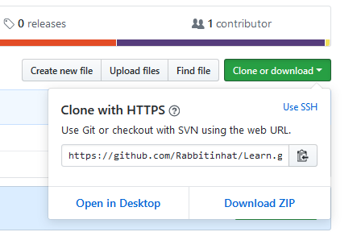
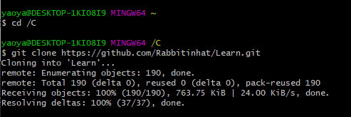

# Github 使用总结

`GitHub`是一个利用`Git`进行版本控制, 专门用于存放软件代码和内容的共享共享虚拟主机服务

系统: `Windows10`

## 注册账号&创建仓库
***


点击`New repository`进入创建页面


填写库名和简短描述

## 在本地配置GIT
***

### 1. 下载并安装`window`版`git`

### 2. 配置git
打开`git`文件夹中的`git bash`
配置git


在命令行输入 
```
ssh-keygen -t rsa -C "自己的邮箱地址"

```


回车后, 输入保存密钥的地址; 不输入则使用默认地址(括号中内容)


设置密码


成功生成密钥


找到`id_rsa.pub`, 复制全部内容(?)

回到`github`官网, 点击右上角头像进入`Settings`页面


在左侧选项栏中找到并点击选项`SSH and GPG keys`


点击`New SSH key`按钮, 进入创建页面


title任意, 在key中粘贴上从`id_rsa.pub`中复制的内容, 最后点击`Add SSH Key`


验证是否成功: 在`git bash`中输入
```
ssh -T git@github.com
```


配置用户名和邮箱
```
git config -global user.name "用户名"
git config -global user-email "邮箱"
```


## 3. 托管项目
***
1.克隆库
进入想要克隆的库, 点击`Clone and download`按钮,复制链接



使用`cd`命令进入想要保存本地库的硬盘
克隆库到本地
```
    git clone 复制的链接
```
本地就会出现一个同名库的副本



2.管理本地库
`cd`命令进入想要作为库的文件夹
输入命令
```
    git init
```
就会在文件夹中建立一个.git的目录, Git用于跟踪管理版本


## 4. 上传文件到仓库
***
增加命令
```
    //. 用于提交所有, 输入文件名可以单独提交
    git add ./filename
```
提交命令
```
    git commit -m "提示信息"
```
推送命令
```
    //branch: 分支名
    git push origin <branch>
```
`git push -f`

完成推送,可以在网站上进行查看

